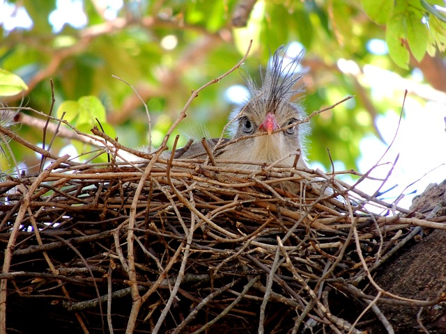
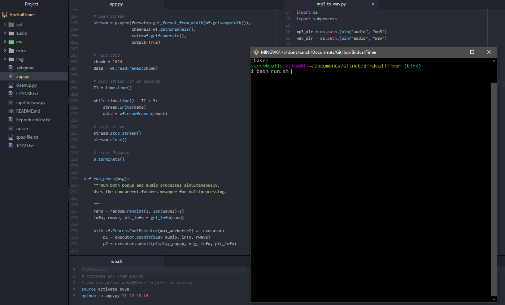

# Birdcall Timer


**A timer for bird lovers.**

<p align="center"></p>
<p align="right" style="font-size: 12px">Siriema hatchling by <a href="https://pixabay.com/users/jrperes-103619/">Junior Peres Junior</a></p>

---

## [Background](#background)

My partner needed a customizable timer for sitting and standing while doing her computer work at a stand-up desk. 

She's also a bird-watching geek (tip: use light mode goggles for this README *just this once*...)
<p align="center"></p>
<p align="right" style="font-size: 12px">Image by <a href="https://pixabay.com/users/clker-free-vector-images-3736/">Clker-Free-Vector-Images</a></p>

I created a simple timer that randomly draws from a collection of birdcalls and plays one, while also displaying some information about that bird and its picture. This will help my partner memorize which birdcalls are associated with which birds.

<p align="center"></p>
<p align="right" style="font-size: 12px">Image by <a href="https://pixabay.com/users/artrose-16042123/">Art Rose</a></p>


*DISCLAIMER: I am not responsible for any brain damage associated with the following logic.*

My partner discovered with triumphant glee that by using this timer to both regulate her sit-stand routine **and** learn birdcalls, she will have "killed two birds with one stone"...

---

## [Demo](#demo)

A brief demo of the timer with dummy (fast) wait times. 

The recordings in this demo can be heard in the following xeno-canto links: 

- [Western Bluebird](https://xeno-canto.org/351734)
- [Galdwall](https://xeno-canto.org/182283)
- [Black-headed Grosbeak](https://xeno-canto.org/372614)
- [Louisiana Waterthrush](https://xeno-canto.org/176655)

<p align="center"></p>

---

## [Running the Timer](#running-the-timer)

Run the timer with the command `bash run.py`, which takes 4 arguments:
- **first_action**: the first desired action, either `sit` or `stand`
- **mins1**: the number of minutes for the first action
- **mins2**: the number of minutes for the alternative action
- **times**: the number of times the loop (action 1, action 2) will be repeated

```bash
$ bash run.py <first_action, {sit|stand}> <mins1 (float: 0-90)> <mins2 (float: 0-90)> <times (int: 1-10)>

# Example:
# Sit for 45 mins, then stand for 10 mis, repeat process 3 times
$ bash run.py sit 45 10 3

```

While minutes can have decimals (float type), times has to be an integer. Minutes can only be from 0 to 90 inclusive, and times from 1 to 10 inclusive.

I'm using a **bash script** instead of a **python script** to run the timer because I wanted a single command and the python program imports packages that need to be pre-installed, such as `wave` and `pyaudio`. For ease of reproducibility (see [below](#reproducibility)) I used a virtual environment that needs to be activated before running the script.

A quick look at the `run.py` script shows how it calls the `python app.py` script, passing the 4 arguments to it:

```bash
#!/bin/bash
# activate env from source
# and run python unbuffered to print to console
source activate py38
python -u app.py $1 $2 $3 $4
```

---

## [Reproducibility](#reproducibility)

### Limitations

The timer is not 100% reproducible AS IS in this repo - namely: I refrained from uploading (and redistributing) massive amounts of audio and image data. 

That said, the code and metadata files are freely distributed in this repo and this section provides instructions on how to reproduce the timer's data.

### Reproducing the Environment

If you do NOT have Python, Miniconda, and/or Git Bash installed, you must first install those. Assuming you're a Windows user:

1. Download and install [Python 3.8](https://www.python.org/downloads/release/python-3810/)
2. Download and install [Miniconda](https://docs.conda.io/en/latest/miniconda.html)
3. Download and install [Git Bash](https://git-scm.com/download/)

After cloning this repo to your local repo, to reproduce the `py38` python 3.8 virtual environment for this project, issue the following command:

```bash
$ conda create --name py38 --file spec-file.txt
```

If this fails, follow step-by-step instructions in `Reproducibility.txt` to create this environment.


### File Structure

Both audio and images need to be downloaded and stored in the `audio` and `img` folders, as shown:

```
root
  ├ audio/
  |   ├ mp3/
  |   |  ├ amegfi/
  |   |  |    ├ XC315598.mpg
  |   |  |    ├ XC496109.mpg
  |   |  |    ├ ...
  |   |  |
  |   |  ├ amerob/
  |   |  ├ ...
  |   |  
  |   └ wav/
  |      ├ amegfi/
  |      |    ├ XC315598.wav
  |      |    ├ XC496109.wav
  |      |    ├ ...
  |      |
  |      ├ amerob/
  |      ├ ...
  |      
  ├ img/
  |  ├ ebird/
  |  |  ├ amegfi.png
  |  |  ├ amerob.png
  |  |  ├ ...
  |  |
  |  ├ ...
  |  └ siriema.jpg
  |
  ├ ...
  ├ run.sh  
  └ spec-file.txt
  
```

### Details

- each recording must be stored in a subfolder with the `ebird_code` abbreviation of the bird species
- `mp3` must be converted to `wav`: I've created a python script that does this in bulk (`mp3-to-wav.py`)
- `jpg` must be converted to `png`: I've created a python script that does this in bulk (`jpg-to-png.py`)
- there is no need to store images under subfolders, the timer shows images at the bird-species level
	+ this is why image names are `ebird_codes` not `XCodes` (xeno-canto catalogue # for specific recordings)
- images are usually 480px by 320px, when that is not the case, they must be cropped to fit these dimensions

Audio can be downloaded from the **xeno-canto project** (see [Acknowledgments](#acknowledgments)) and images can be downloaded from the [Macaulay Library.](https://macaulaylibrary.org/) 

### Metadata

If a specific recording is not in the `csv/rec_metadata.csv` file, at a minimum, the following metadata must be entered in the file:

- **ebird_code**: the abbreviated species name 
- **species**: the full species name 
- **date**: the date of the recording 
- **country**: the country of the recording
- **recordist**: the recordist's full name 

For images, the following metadata must be entered in the `csv/pic_metadata.csv` file:

- **ebird_code**: the abbreviated species name 
- **url**: the Macaulay Library URL, Ex: https://macaulaylibrary.org/asset/357081241
- **copyright**: the photographer's full name for the copyright notice 

### Final Step 

The `csv/chosen.csv` file contains the **XCodes** for recordings chosen to be randomly selected by the timer script. As a final step, the numeric portion of this catalogue number (Ex. for `XC315598`, the `315598` part) must be entered in this file.

---

## [Acknowledgments](#acknowledgments)

I'm indebted to and grateful for the **xeno-canto project** ([www.xeno-canto.org](https://www.xeno-canto.org/)) and the [Macaulay Library](https://macaulaylibrary.org/) at the [Cornell Lab of Ornithology](https://www.birds.cornell.edu/home) for their impressive collections of bird sounds and pictures, respectively.

I downloaded bird recordings and recording metadata from the Kaggle machine-learning competition [Cornell Birdcall Identification](https://www.kaggle.com/c/birdsong-recognition). Bird pictures and picture metadata were manually obtained from the Macaulay Library.

---


