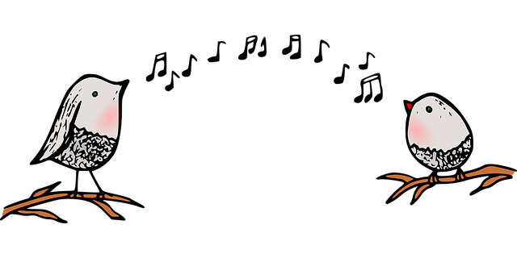
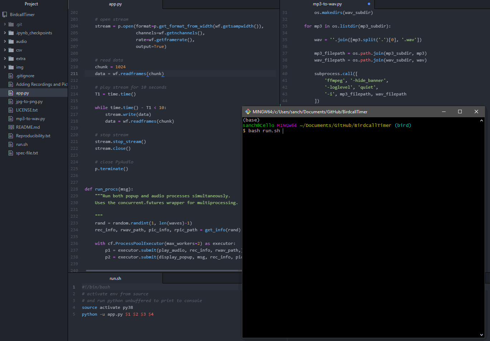

# Birdcall Timer

**A timer for bird lovers.**

<p align="center"></p>
<p align="right" style="font-size: 12px">Siriema hatchling by <a href="https://pixabay.com/users/jrperes-103619/">Junior Peres Junior</a></p>

---

## [Background](#background)

My partner needed a customizable timer for sitting and standing while doing her computer work at a stand-up desk. 

She's also a bird-watching geek. 
<p align="center"></p>
<p align="right" style="font-size: 12px">Image by <a href="https://pixabay.com/users/clker-free-vector-images-3736/">Clker-Free-Vector-Images</a></p>

I created a simple timer that randomly draws from a collection of birdcalls and plays one, while also displaying some information about that bird and its picture. This will help my partner memorize which birdcalls are associated with which birds.

<p align="center"></p>
<p align="right" style="font-size: 12px">Image by <a href="https://pixabay.com/users/artrose-16042123/">Art Rose</a></p>


*DISCLAIMER: I am not responsible for any brain damage associated with the following logic.*

My partner discovered with triumphant glee that by using this timer to both regulate her sit-stand routine **and** learn birdcalls, she will have "killed two birds with one stone"...

---

## [Demo](#demo)

A brief demo of the timer with dummy (fast) times - unfortunately, it misses the main feature: the birdcall!

<p align="center"></p>

---

## [Running the Timer](#running-the-timer)

Run the timer with the command `bash run.py`, which takes 4 arguments:
- **first_action**: the first desired action, either `sit` or `stand`
- **mins1**: the number of minutes for the first action
- **mins2**: the number of minutes for the alternative action
- **times**: the number of times the loop (action 1, action 2) will be repeated

```bash
$ bash run.py <first_action, {sit|stand}> <mins1 (float: 0-90)> <mins2 (float: 0-90)> <times (int: 1-10)>

# Example:
# Sit for 45 mins, then stand for 10 mis, repeat process 3 times
$ bash run.py sit 45 10 3

```

While minutes can have decimals (float type), times has to be an integer. Minutes can only be from 0 to 90 inclusive, and times from 1 to 10 inclusive.

I'm using a **bash script** instead of a **python script** to run the timer because I wanted a single command and the python program imports packages that need to be pre-installed, such as `wave` and `pyaudio`. For ease of reproducibility (see [below](#reproducibility)) I used a virtual environment that needs to be activated before running the script.

A quick look at the `run.py` script shows how it calls the `python app.py` script, passing the 4 arguments to it:

```bash
#!/bin/bash
# activate env from source
# and run python unbuffered to print to console
source activate py38
python -u app.py $1 $2 $3 $4
```

---

## [Reproducibility](#reproducibility)

`TODO: EXPAND`

---

## [Acknowledgments](#acknowledgments)

I'm indebted to the **xeno-canto project** ([www.xeno-canto.org](https://www.xeno-canto.org/)) and the [Macaulay Library](https://macaulaylibrary.org/) at the [Cornell Lab of Ornithology](https://www.birds.cornell.edu/home) for their impressive collections of bird sounds and pictures, respectively.

I downloaded bird recordings and recording metadata from the Kaggle machine-learning competition [Cornell Birdcall Identification](https://www.kaggle.com/c/birdsong-recognition). Bird pictures and picture metadata were manually obtained from the Macaulay Library.

---


